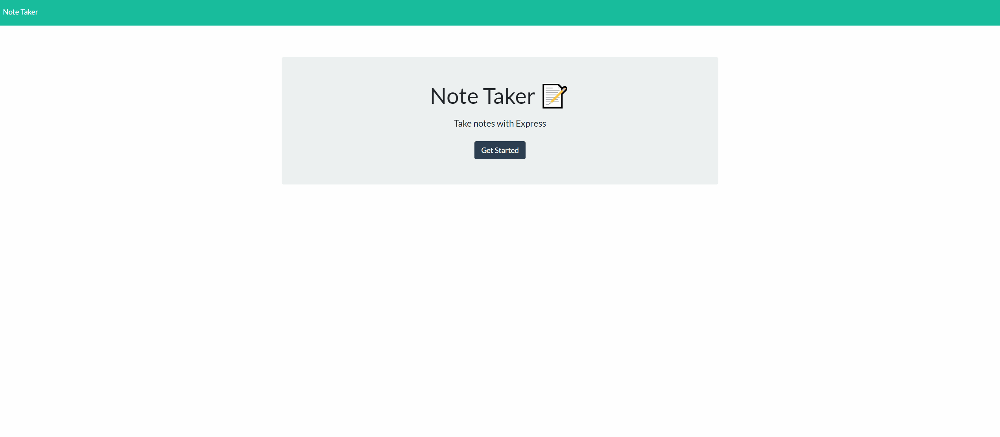

# Note Taker

 
### Table of Contents:
* [User Story](##-User-Story)
* [Description](##-Description)
* [Installation](##-Installation)
* [Credits](##-Credits)
* [Contributors](##-Contributors)
* [License](##-License)
 
## Deployed site
[Note Taker](https://note-taker-en.herokuapp.com/)

 
## User Story
AS A small business owner
I WANT to be able to write and save notes
SO THAT I can organize my thoughts and keep track of tasks I need to complete
 
## Description
A note taking app using Node and Express.
 
## Installation
Install dependencies with npm i and run on Node.

## Contributors
Efrain Nevarez
 
## Credits
HTML, CSS, Node, Express, Heroku, JavaScript
 
## License
This project is licensed by MIT